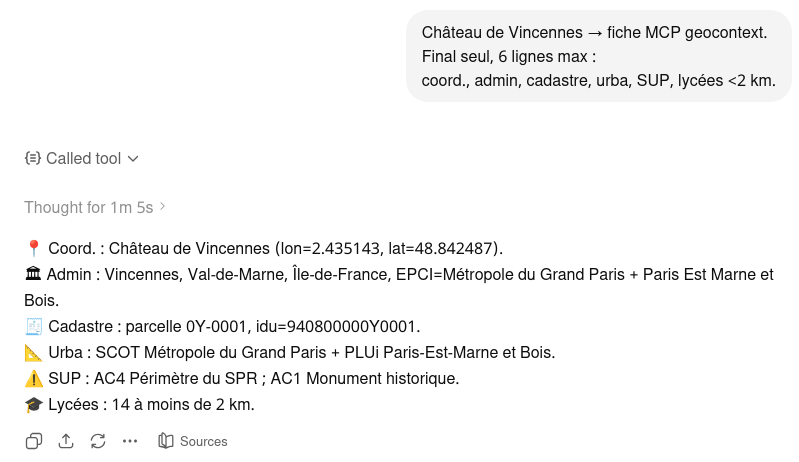
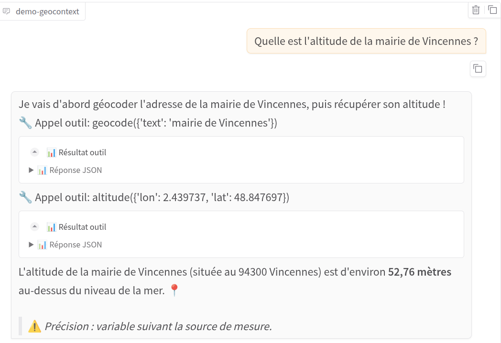
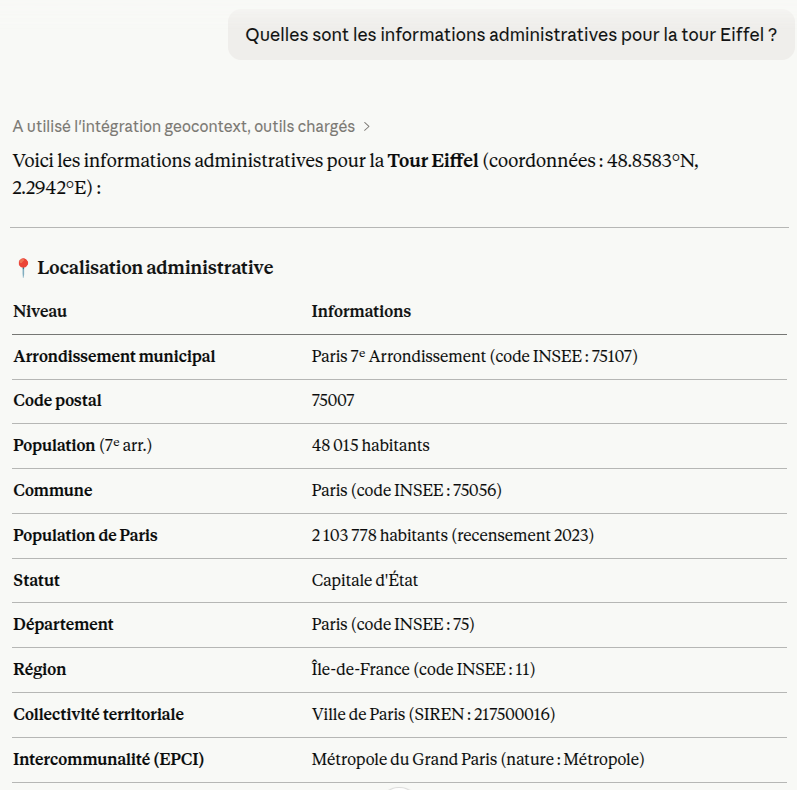
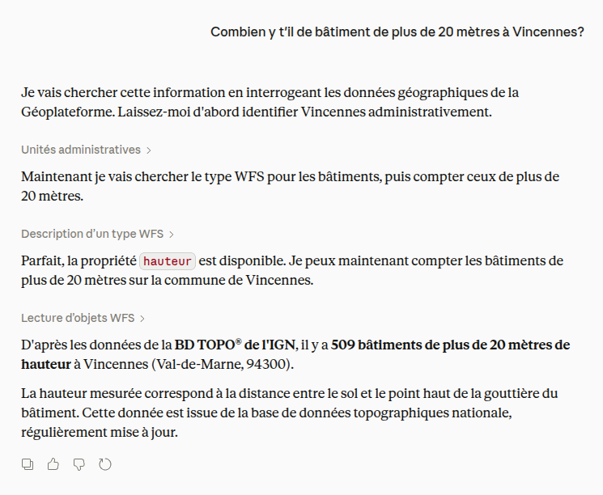
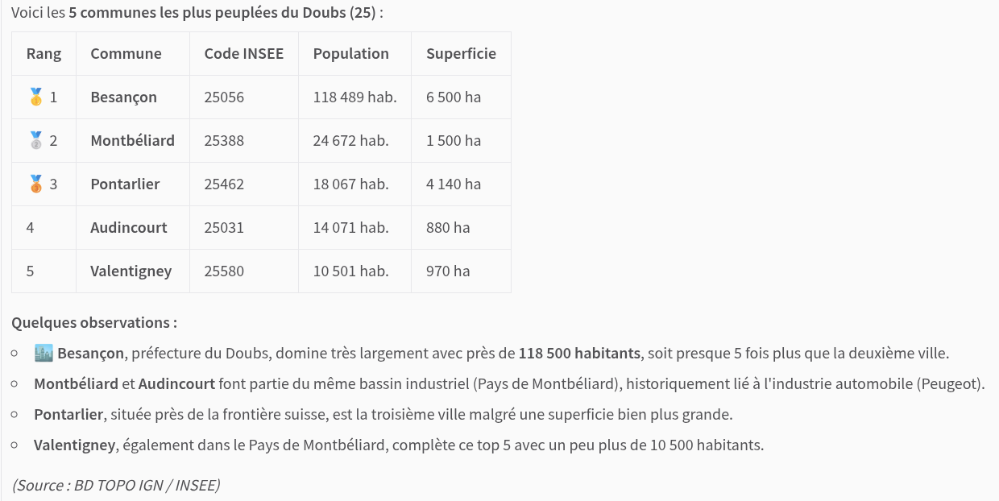
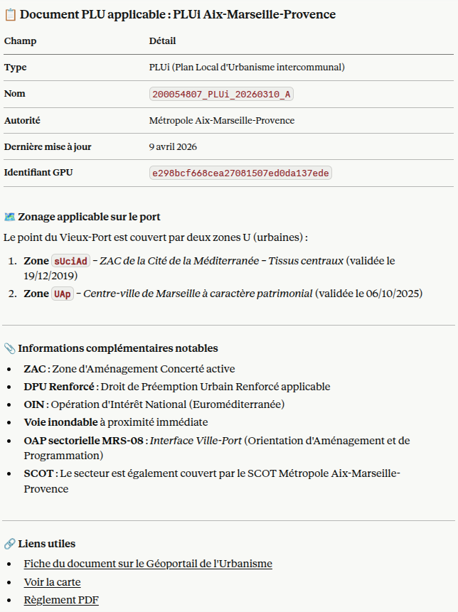
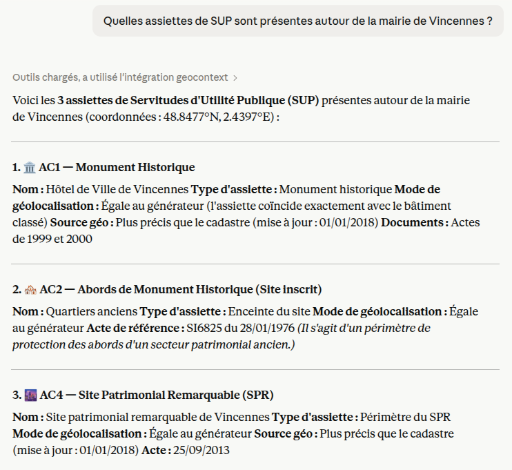
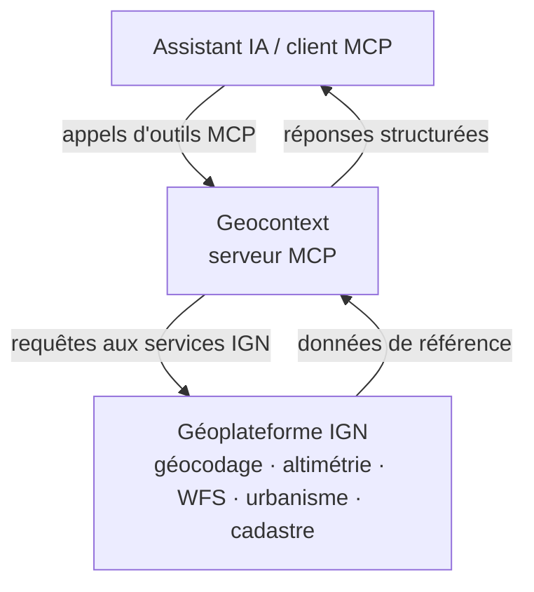

<p align="center">
  
</p>

# Geocontext

[](https://www.npmjs.com/package/@ignfab/geocontext) [](https://github.com/ignfab/geocontext)

**Geocontext** est un [serveur MCP](https://modelcontextprotocol.io/docs/getting-started/intro) qui permet aux assistants IA d’interroger les données géographiques françaises de référence publiées sur la [Géoplateforme de l'IGN](https://cartes.gouv.fr/aide/fr/guides-utilisateur/utiliser-les-services-de-la-geoplateforme).

<p align="center">
  
</p>

## Pourquoi Geocontext ?

- **Pas de téléchargement** — Geocontext interroge directement les services de la Géoplateforme IGN, sans copie locale ni synchronisation à maintenir.
- **Données de référence à jour** — les réponses s’appuient sur les référentiels géographiques publiés en continu par l’IGN et ses partenaires.
- **Réponses optimisées pour les LLM** — les traitements et filtrages sont faits côté serveur pour limiter les tokens transmis au modèle.
- **Moins d’hallucinations** — les descriptions et schémas enrichis aident l’assistant à identifier les bonnes données et les bons champs (implémentation anticipée de [OGC API Feature - schema](https://docs.ogc.org/is/23-058r2/23-058r2.html) dans [ignfab/gpf-schema-store](https://github.com/ignfab/gpf-schema-store)).
- **Compatible MCP** — utilisable avec des clients compatibles MCP comme Claude Desktop, Cursor ou MCPJam, mais aussi directement dans certaines interfaces de chat en ligne compatibles, comme Claude, Le Chat de Mistral ou ChatGPT, via leurs connecteurs MCP.

## Démo en 30 secondes

**Question**

> Combien y a-t-il de bâtiments de plus de 20 mètres à Vincennes ?

**Réponse**

> À Vincennes (94300, Val-de-Marne), il y a **509 bâtiments** de plus de **20 mètres de hauteur**, selon les données de la **BD TOPO®** de l'IGN.  
> La hauteur prise en compte est celle mesurée entre le sol et le point haut de la gouttière du bâtiment.

**Trace complète**

<details>
  <summary>Voir la trace complète</summary>

```text
💬 Je vais d'abord rechercher les informations nécessaires :
   les coordonnées de Vincennes et le type WFS pour les bâtiments.
🔧 Appel outil: geocode({'text': 'Vincennes'})
🔧 Appel outil: gpf_wfs_search_types({'query': 'bâtiment hauteur'})

💬 Parfait ! J'ai trouvé le type WFS BDTOPO_V3:batiment.
   Je vais maintenant récupérer le schéma de ce type pour connaître
   les propriétés exactes, notamment la hauteur et le code INSEE de Vincennes.
🔧 Appel outil: gpf_wfs_describe_type({'typename': 'BDTOPO_V3:batiment'})
🔧 Appel outil: adminexpress({'lon': 2.437785,'lat': 48.847279})

💬 J'ai toutes les informations nécessaires.
   La commune de Vincennes a le feature_id commune.33667.
   Je vais maintenant compter les bâtiments de plus de 20 mètres
   de hauteur sur cette commune.
🔧 Appel outil: gpf_wfs_get_features({
  'typename': 'BDTOPO_V3:batiment',
  'result_type': 'hits',
  'where': [
    {
      'property': 'hauteur',
      'operator': 'gt',
      'value': '20'
    }
  ],
  'spatial_operator': 'intersects_feature',
  'intersects_feature_typename': 'ADMINEXPRESS-COG.LATEST:commune',
  'intersects_feature_id': 'commune.33667'
   })

💬 À Vincennes (`94300`, Val-de-Marne), il y a **509 bâtiments**
   de plus de **20 mètres de hauteur**, selon les données
   de la **BD TOPO®** de l'IGN.
   La hauteur prise en compte est celle mesurée entre le sol
   et le point haut de la gouttière du bâtiment.
```
</details>

## Démarrage rapide

### ☁️ Instance HTTP prête à l'emploi

Geocontext est disponible comme serveur MCP distant en HTTP : https://geollm.beta.ign.fr/geocontext/mcp

Exemple de configuration pour un client compatible MCP acceptant les serveurs HTTP distants :

```json
{
  "mcpServers": {
    "geocontext": {
      "type": "http",
      "url": "https://geollm.beta.ign.fr/geocontext/mcp"
    }
  }
}
```

Selon le client utilisé, la syntaxe exacte peut varier. Certaines interfaces de chat compatibles MCP demandent simplement l’URL du serveur distant dans leurs paramètres de connecteurs.

### 💻 Utilisation en local

> Prérequis : Node.js (`>=22.21.0`, `>=24.5.0` recommandé, à contrôler avec `node --version`) avec `npx`.

Vous pouvez lancer Geocontext vous-même en local avec la commande `npx -y @ignfab/geocontext` qui démarrera la dernière version publiée de [@ignfab/geocontext](https://www.npmjs.com/package/@ignfab/geocontext) ou laisser un client MCP comme Cursor le démarrer pour vous via sa configuration.

Par exemple, dans Cursor ("Settings" > "MCP" > "Add server"):

```json
{
  "mcpServers": {
    "geocontext": {
      "command": "npx",
      "args": ["-y", "@ignfab/geocontext"]
    }
  }
}
```

## Exemples d’utilisation

### Géocodage et altimétrie

<details>
    <summary><strong>Quelle est l'altitude de la mairie de Vincennes ?</strong></summary>
    <p>
      
    </p>
</details>

### ADMIN-EXPRESS et CADASTRE

<details>
    <summary><strong>Quelles sont les informations administratives pour la tour Eiffel ?</strong></summary>
    <p>
      
    </p>
</details>

### BDTOPO

<details>
    <summary><strong>Combien y a-t-il de bâtiments de plus de 20 mètres à Vincennes ?</strong></summary>
    <p>
      
    </p>
</details>

<details>
    <summary><strong>Quelles sont les 5 communes les plus peuplées du Doubs ?</strong></summary>
    <p>
      
    </p>
</details>

### Géoportail de l'Urbanisme

<details>
    <summary><strong>Quel est le document PLU en vigueur pour le port de Marseille ?</strong></summary>
    <p>
      
    </p>
</details>

<details>
    <summary><strong>Quelles assiettes de SUP sont présentes autour de la mairie de Vincennes ?</strong></summary>
    <p>
      
    </p>
</details>

## Fonctionnalités disponibles

Les fonctionnalités correspondent aux outils MCP documentés dans [`docs/mcp-tools.md`](docs/mcp-tools.md).

| Usage                               | Outil MCP                   | Source utilisée                                                                                                                                                                                                              | Exemple                         |
| ----------------------------------- | --------------------------- | ---------------------------------------------------------------------------------------------------------------------------------------------------------------------------------------------------------------------------- | ------------------------------- |
| Géocoder un lieu                    | `geocode`                   | [Autocomplétion Géoplateforme](https://cartes.gouv.fr/aide/fr/guides-utilisateur/utiliser-les-services-de-la-geoplateforme/autocompletion/)                                                                                  | Localiser une mairie            |
| Obtenir une altitude                | `altitude`                  | [Calcul altimétrique Géoplateforme](https://cartes.gouv.fr/aide/fr/guides-utilisateur/utiliser-les-services-de-la-geoplateforme/calcul-altimetrique/)                                                                        | Altitude d'un point             |
| Récupérer le contexte administratif | `adminexpress`              | [WFS](https://cartes.gouv.fr/aide/fr/guides-utilisateur/utiliser-les-services-de-la-geoplateforme/diffusion/wfs/) + [ADMIN-EXPRESS](https://cartes.gouv.fr/rechercher-une-donnee/dataset/IGNF_ADMIN-EXPRESS)                 | Commune, département, région    |
| Récupérer le cadastre               | `cadastre`                  | [WFS](https://cartes.gouv.fr/aide/fr/guides-utilisateur/utiliser-les-services-de-la-geoplateforme/diffusion/wfs/) + [PARCELLAIRE-EXPRESS](https://cartes.gouv.fr/rechercher-une-donnee/dataset/IGNF_PARCELLAIRE-EXPRESS-PCI) | Parcelle cadastrale             |
| Récupérer les documents d'urbanisme | `urbanisme`                 | [WFS](https://cartes.gouv.fr/aide/fr/guides-utilisateur/utiliser-les-services-de-la-geoplateforme/diffusion/wfs/) + [données GPU](https://www.geoportail-urbanisme.gouv.fr/)                                                 | PLU, POS, CC                    |
| Récupérer les servitudes            | `assiette_sup`              | [WFS](https://cartes.gouv.fr/aide/fr/guides-utilisateur/utiliser-les-services-de-la-geoplateforme/diffusion/wfs/) + [données GPU](https://www.geoportail-urbanisme.gouv.fr/)                                                 | SUP autour d'un lieu            |
| Trouver une couche WFS              | `gpf_wfs_search_types`      | [gpf-schema-store](https://github.com/ignfab/gpf-schema-store)                                                                                                                                                               | Trouver la table des bâtiments  |
| Décrire une couche WFS              | `gpf_wfs_describe_type`     | [gpf-schema-store](https://github.com/ignfab/gpf-schema-store)                                                                                                                                                               | Lister les champs disponibles   |
| Interroger une couche WFS           | `gpf_wfs_get_features`      | [WFS](https://cartes.gouv.fr/aide/fr/guides-utilisateur/utiliser-les-services-de-la-geoplateforme/diffusion/wfs/)                                                                                                            | Extraire ou compter des objets  |
| Récupérer un objet par identifiant  | `gpf_wfs_get_feature_by_id` | [WFS](https://cartes.gouv.fr/aide/fr/guides-utilisateur/utiliser-les-services-de-la-geoplateforme/diffusion/wfs/)                                                                                                            | Charger une commune précise     |

## Architecture en bref

Geocontext agit comme un intermédiaire entre un assistant compatible MCP et les services de la Géoplateforme IGN.

Il n’héberge pas les données : il expose des outils MCP, interroge les services IGN à la demande, puis retourne au LLM des réponses structurées, filtrées et adaptées à son contexte.



En pratique, Geocontext permet à l’assistant de passer d’une question en langage naturel à des appels aux données géographiques de référence, sans téléchargement préalable ni copie locale des référentiels.

## Statut et limites

- 🧪 Ce projet est un **prototype en incubation** au sein d'[IGNfab](https://www.ign.fr/ignfab), basé sur un [prototype antérieur désormais archivé](https://github.com/mborne/geocontext). S'il s'avère pertinent de l'industrialiser, il sera migré vers l'[organisation IGN principale](https://github.com/ignf) (ex. : `IGNF/mcp-gpf-server`).
- 🪄 Cet outil n'est pas magique : ses capacités sont strictement définies et documentées dans la section [Fonctionnalités](#fonctionnalités-disponibles).

## Documentation

La documentation détaillée est répartie par usage :

- **Installer Geocontext dans un client MCP**
  - [Utilisation avec Claude Desktop](docs/usage/claude-desktop.md)
  - [Utilisation avec MCPJam](docs/usage/mcpjam.md)

- **Configurer le serveur MCP**
  - [Configuration avancée](docs/config.md) : proxy d’entreprise, modes de transport `stdio` / `http`, paramètres d’exécution.

- **Comprendre les outils disponibles**
  - [Outils MCP](docs/mcp-tools.md) : description technique des outils exposés par Geocontext, paramètres attendus et exemples d’appels.

- **Développer ou contribuer au code**
  - [Guide développeur](docs/dev.md) : installation des dépendances, construction de l’application, exécution des tests et organisation du projet.

## Contribution

### 🐛 Signaler un problème

N'hésitez pas à [créer une issue](https://github.com/ignfab/geocontext/issues) si vous rencontrez un problème !

**Merci de fournir** :

- Le **client MCP** (ex. : GitHub Copilot, Cursor, Claude Desktop) et le **mode de transport** (stdio ou http) utilisé.
- Le **modèle** utilisé (ex. : Claude Sonnet 4.5)
- La **version de Geocontext** (visible sur [npmjs.com/@ignfab/geocontext](https://www.npmjs.com/package/@ignfab/geocontext) ou avec `npx @ignfab/geocontext --version`)
- La **demande** faite à l'assistant (**ex. : "Combien y a-t-il de ponts franchissant la Seine ?"**)
- Si possible, un export de la discussion au format Markdown.

### ✨ Demander une évolution

N'hésitez pas non plus à [créer une issue](https://github.com/ignfab/geocontext/issues) pour demander une évolution.

Merci de **fournir la question type** pour laquelle vous souhaiteriez que le MCP aide à apporter une réponse. Par exemple :

- "Combien y a-t-il de bâtiments à moins de 5 km à pied de la tour Eiffel ?" -> nous verrons comment exploiter les isochrones
- "Quels sont les fonds de carte disponibles ?" -> nous verrons comment exploiter le service WMTS de la Géoplateforme.

## Crédits

- [mcp-framework](https://mcp-framework.com) : **cadre de développement du MCP** 
- [@ignfab/gpf-schema-store](https://www.npmjs.com/package/@ignfab/gpf-schema-store) : **couche sémantique** / **catalogue de schémas embarqué** (en attendant [OGC API - Features - schema](https://docs.ogc.org/is/23-058r2/23-058r2.html))
    - [@camptocamp/ogc-client](https://camptocamp.github.io/ogc-client/#/) : **exploration WFS** (ex. : parsing [GetCapabilities](https://data.geopf.fr/wfs?request=GetCapabilities&version=2.0.0&service=WFS))
    - [MiniSearch](https://github.com/lucaong/minisearch) : **recherche par mot-clé** (`gpf_wfs_search_types`)
- [jsts](https://bjornharrtell.github.io/jsts/) : **traitements géométriques** (ex. : tri des réponses par distance au point recherché).
- [turfjs/distance](https://turfjs.org/docs/api/distance) : **calculs de distance** avec la [formule de Haversine](https://en.wikipedia.org/wiki/Haversine_formula).

## Voir également

- https://github.com/datagouv/datagouv-mcp : MCP data.gouv.fr

> Exemple : Qui est le maire de la commune de Vincennes ?

- https://git.tricoteuses.fr/logiciels/tricoteuses-api-parlement :  MCP parlement français non officiel
- https://github.com/datagouv/datagouv-skill : Skills data.gouv.fr

## Licence

[MIT](LICENSE)
