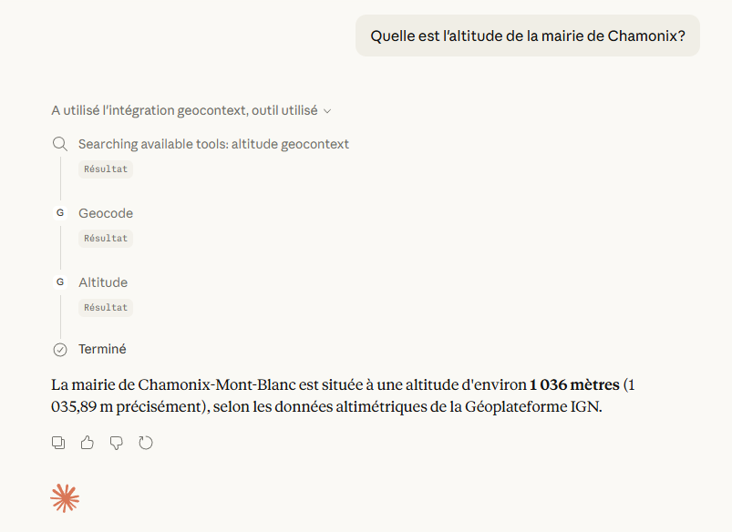

# Exemple d'utilisation avec Claude Desktop

## Configuration avec MCP Geocontext et MCP Datagouv

```json
{
  "mcpServers": {
    "geocontext": {
      "command": "npx",
      "args": ["-y", "@ignfab/geocontext"]
    },
  "datagouv": {
      "command": "npx",
      "args": [
        "mcp-remote",
        "https://mcp.data.gouv.fr/mcp"
      ]
    }
  },
  "preferences": {
    "coworkScheduledTasksEnabled": false,
    "sidebarMode": "chat",
    "coworkWebSearchEnabled": false,
    "ccdScheduledTasksEnabled": true
  }
}
```

## Exemple d'utilisation



