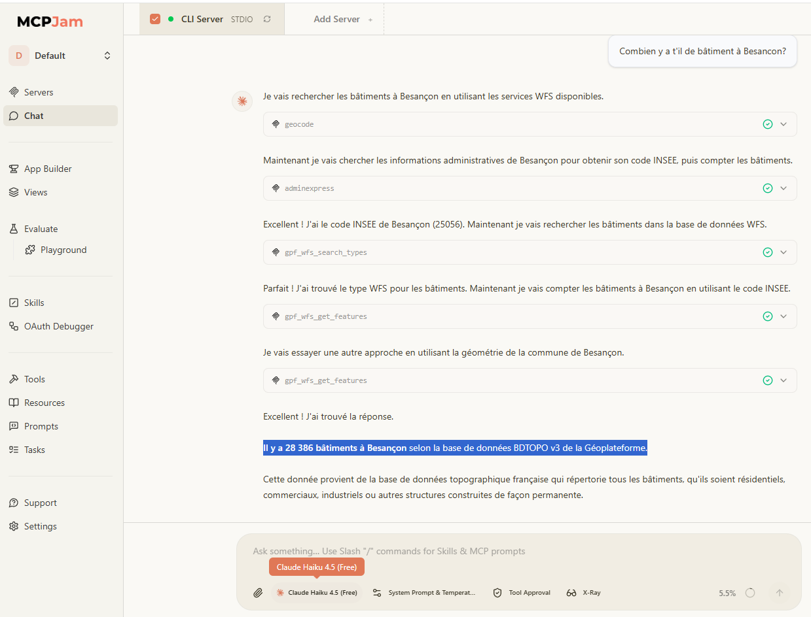

# Exemple d'utilisation avec MCPJam

## Lancement

Sous Linux

```bash
npx @mcpjam/inspector@latest node $(pwd)/dist/index.js
```
Sous Windows

```bash
npx @mcpjam/inspector@latest node $PWD\dist\index.js
```

## Exemple d'utilisation

